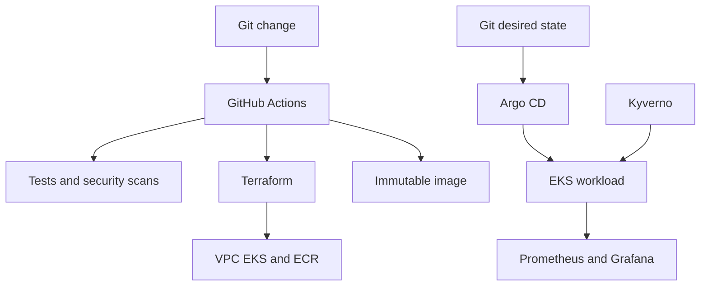

# CloudForge AWS DevOps Platform

CloudForge is a reproducible, short-lived AWS platform project that demonstrates infrastructure provisioning, secure CI/CD, GitOps delivery, Kubernetes operations, observability, policy enforcement and controlled teardown. It deploys a small instrumented service to Amazon EKS and records evidence for each stage of the lifecycle.

This is a working portfolio environment—not a production traffic claim. AI assisted its development, and the repository includes tests, design decisions and an explicit [AI usage statement](AI_USAGE.md).

## What the project proves

| Capability | Implementation |
|---|---|
| Infrastructure as Code | Modular Terraform for a two-AZ VPC, private worker subnets, EKS, ECR and lifecycle controls |
| Secure cloud authentication | GitHub Actions OIDC role scoped to this repository and its protected `demo` environment |
| Continuous integration | Python tests, container build, vulnerability scan, Terraform validation and Helm linting |
| GitOps | Argo CD pulls the Helm chart from Git, auto-syncs, prunes and self-heals drift |
| Kubernetes security | Non-root immutable container, dropped capabilities, NetworkPolicy and Kyverno enforcement |
| Observability | Prometheus metrics, alert rules, Grafana dashboard, health/readiness probes and a runbook |
| Reliability | Two replicas, rolling updates, PodDisruptionBudget, HPA, immutable SHA image tags and rollback guidance |
| Cost control | Manual deployment confirmation, resource tags and a gated destroy workflow |

## Architecture



See [the detailed architecture](docs/ARCHITECTURE.md) for boundaries and tradeoffs.

## Repository layout

```text
app/                         Instrumented Python service and tests
bootstrap/                   One-time AWS OIDC and state bootstrap
infrastructure/terraform/    VPC, EKS and ECR infrastructure
platform/chart/              Secure Helm deployment
gitops/applications/         Argo CD application template
policies/                    Kyverno admission policy
observability/               Prometheus values and Grafana dashboard
runbooks/                    Operational recovery procedures
docs/                        Architecture, demo and interview material
.github/workflows/           CI, deployment and destruction workflows
```

## Run locally

The application itself needs only Python 3.12:

```bash
make test
make run
curl http://127.0.0.1:8080/
curl http://127.0.0.1:8080/metrics
```

With Docker, kind, kubectl and Helm installed, deploy the same chart to a local Kubernetes cluster:

```bash
./scripts/local-demo.sh
kubectl port-forward service/cloudforge 8080:80 -n cloudforge
```

## Deploy the temporary AWS demonstration

AWS resources in this section are billable. Deploy only when ready to record the demonstration, and destroy them immediately afterward.

1. Create a public GitHub repository named `cloudforge-platform` and push this project to its `main` branch.
2. In AWS CloudFormation, create a stack named `cloudforge-github-bootstrap` using [`bootstrap/aws-oidc-role.yaml`](bootstrap/aws-oidc-role.yaml). Supply your GitHub username and repository name.
3. Create a protected GitHub environment named `demo`.
4. Add the three CloudFormation outputs as GitHub repository variables named `AWS_ROLE_ARN`, `TF_STATE_BUCKET` and `AWS_REGION`.
5. Verify the `Continuous Integration` workflow succeeds.
6. Manually run `Deploy AWS Demo` and enter `DEPLOY`.
7. Follow [the demonstration script](docs/DEMO.md) and capture evidence.
8. Manually run `Destroy AWS Demo`, enter `DESTROY`, and select bootstrap removal when the project is completely finished.

The OIDC model follows GitHub's guidance for obtaining short-lived AWS access without long-lived repository secrets. Argo CD performs deployment by reconciling Git rather than granting the CI pipeline direct application-deployment logic.

## Verification evidence

Before sharing the project on LinkedIn, add these items to a release or `docs/evidence` directory:

- Successful CI workflow screenshot
- Terraform plan summary with account identifiers hidden
- Argo CD application in `Healthy` and `Synced` state
- Grafana dashboard under generated traffic
- Pod deletion and automatic replacement demonstration
- GitOps drift and self-healing demonstration
- Successful destroy workflow and empty-resource checks
- Completed incident report using the supplied template

## Operations and interviews

- [Demo recording sequence](docs/DEMO.md)
- [Service unavailable runbook](runbooks/SERVICE_UNAVAILABLE.md)
- [Incident report template](docs/INCIDENT_REPORT_TEMPLATE.md)
- [Interview guide](docs/INTERVIEW_GUIDE.md)
- [LinkedIn launch draft](docs/LINKEDIN_POST.md)
- [Security policy](SECURITY.md)

## Teardown is mandatory

The EKS control plane, EC2 workers and NAT gateway continue generating charges while they exist. A successful demonstration is not complete until the destroy workflow succeeds and the AWS console shows the temporary stack and resources removed.

## Reference documentation

- [GitHub Actions OIDC with AWS](https://docs.github.com/en/actions/how-tos/secure-your-work/security-harden-deployments/oidc-in-aws)
- [Amazon EKS Kubernetes version lifecycle](https://docs.aws.amazon.com/eks/latest/userguide/kubernetes-versions.html)
- [Argo CD automated synchronization](https://argo-cd.readthedocs.io/en/stable/user-guide/auto_sync/)
- [Terraform tests and validation](https://developer.hashicorp.com/terraform/language/tests)

## License

MIT

