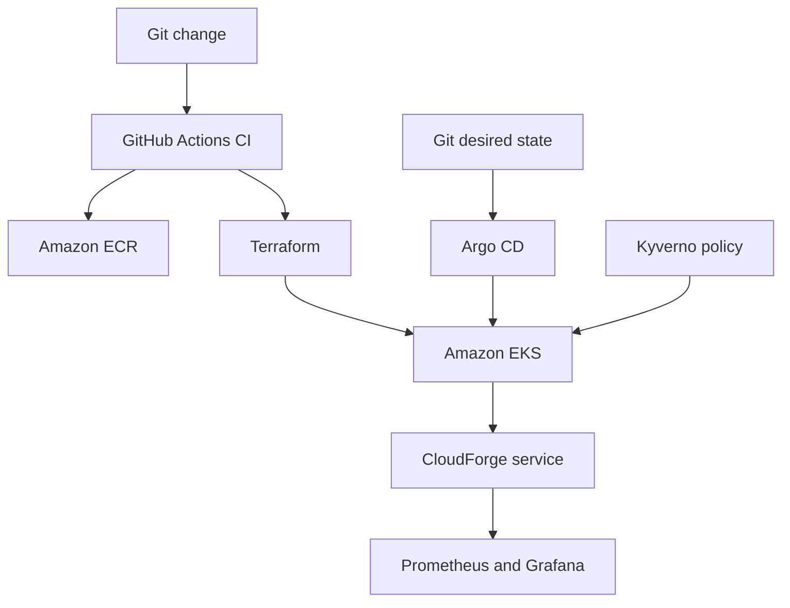

# CloudForge Architecture

CloudForge is a short-lived, production-style AWS platform demonstration. GitHub Actions authenticates to AWS through OIDC, Terraform creates isolated infrastructure, and Argo CD continuously reconciles Kubernetes resources from Git.

## Trust boundaries

- GitHub receives no long-lived AWS access keys. Its OIDC token can assume only the repository- and environment-scoped deployment role.
- Worker nodes run in private subnets. A single NAT gateway provides temporary outbound access during the demonstration.
- The application runs as UID 65532 with a read-only root filesystem, no Linux capabilities, no service-account token, and bounded CPU and memory.
- Argo CD is the deployment reconciler. Manual cluster changes are considered drift and are corrected.
- Kyverno rejects application pods that permit privilege escalation or run as root.

## Availability and cost decisions

Two Availability Zones and two small managed worker nodes demonstrate scheduling and disruption behavior. A single NAT gateway is an intentional short-lived cost tradeoff. This is a portfolio environment, not a claim of production multi-NAT availability.

